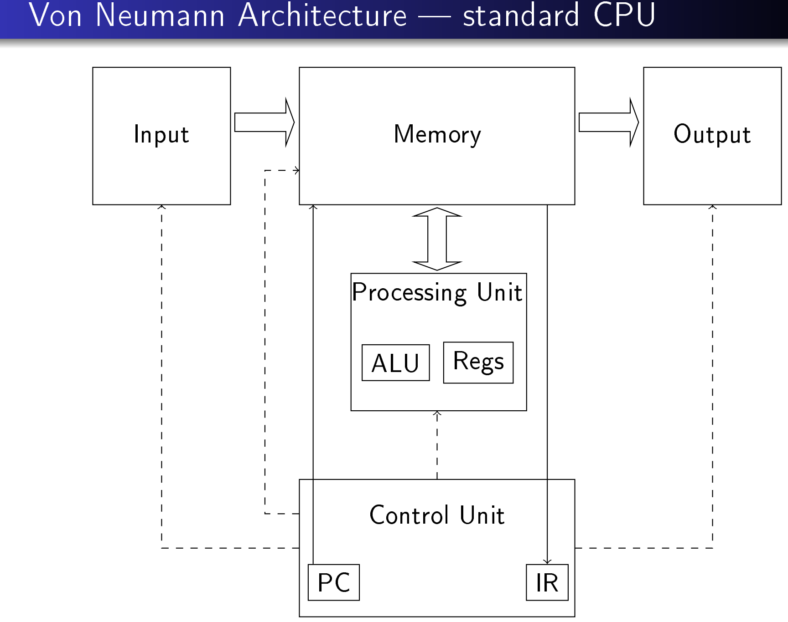
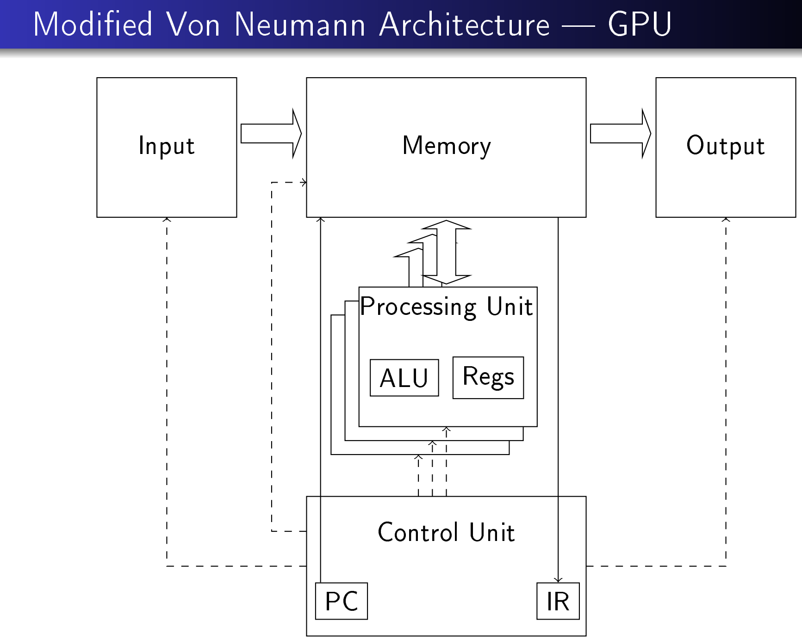

# Types of parallelism
## Task based
Could be same program but doing different parts of that program, the operations are different. GNU make is an example of such a program as it can run sub-tasks in parallel.

Suitable for multi-core CPUs and networks of computers.



## Data based
Same operations in lock step on different data. E.g. Doing same operation to pixels in an image simultaneously, or simulating dynamical systems. Suitable for GPUs. Cores can even share program counter as all cores are doing the same operation but on different data



## Latency vs throughput

### Latency orientated
Best for task-based. Get the result of the first task as soon as possible, then the next, ... .

If an operation takes 4 cycles, 10 operations take 40. There is a long wait for the first result (takes time to fill the pipeline) but following results come very quickly.

Use large caches with temporal and sparial localilty to speed up memory access. Complex control unit with short pipeline, branch prediction and data forwarding.

### Throughput orientated
Best for data-based. Get all results back at roughly the same time and in as little time as possible.

If loading an operation pipeline takes 10 cycles and each result comes back 1 cycle after that, 10 operations takes 19 cycles: 10 + 1 + 1 + 1 ...

Small caches without temporal or spatial locality, instead for staging data (gets lots of data in one go for lots of cores to work on, avoids separate fetches). Simple control unit with no branch prediction or data forwarding. Long pipeline with many cycles per operation. There is a long wait for the first result (takes time to fill the pipeline) but following results come very quickly.

# CUDA
Fuction attributes:
* `__host__`: Function is run on the host (CPU). Default.
* `__global__`: Function is run on the GPU but callable by the CPU.
* `__device__`: Functions is run on the GPU and only callable by the GPU.
`__device` and `__host__` can be combined, which generates two separate functions.

## Cores
We don't want the number of cores the dictate the max/min number of things that can be processed simultaneously, and we don't want to have to change the code to make it work on a different number of threads.
Nvidia GPUs are organised into a hierarchical structure to organise the work.
* A grid is a collection of blocks
	* Corresponds to a whole task (adding a vector of 50,000 elements). A GPU that can execute *b* blocks at a time would schedule 50,000/n blocks, *b* at a time (where n is the block size), hence 50,000/n/b schedulings
* A block is a collection of threads
	* Has between 1 and the max block size number of threads. Typically 1024. The block size should be a multiple of the warp size as otherwise blocks will be padded and the remaining threads will be unused and wasted.
* A thread the execution of the 'kernel' on a single processing unit
* A warp is a set of tightly related threads that must execute fully in lock step with each other. Not part of the CUDA spec but implemented in Nvidia GPUs. Most current GPUs have 32 warps. They are the low-level basis of thread scheduling and if one is scheduled in, all others in the warp are too.

Grids and blocks can be organised as 1-dimensional (suitable for array processing), 2-dimensional (suitable for image processing) or 3-dimensional (suitable for spatial processing).

## Programming
See gpu intro slides for how to calculate the grid structre when invoking a kernel function.

Each thread needs to know which part of the data it should be processing:
* `blockIdx.x`: The unique id for this block in this grid
* `blockDim.x`: The number of threads in a block for this grid
* `threadIdx.x`L The unique id for this thread in the block (between 0 and blockDim.x - 1)

The `blockDim` struct has `.y` and `.z` members too, which can be ignored, depending on the block dimensionality.

```c
__global__ vecAdd(float* A, float* B, float* C, int n) {
	int idx = blockDim.x * blockIdx.x + threadIdx.x;
	// There could be a remainder if the number of elements isn't a multiple of the number of threads scheduled
	if (idx < n) C[i] = A[i] + B[i];
}
```
### Memory
GPUs have their own memory that is unreachable from the CPU, hence there are specialised memory functions executed on the host that then manage GPU memory.

`cudaMalloc` and `cudaFree`manage memory on the GPU. `cudaMemcpy` copies memory from host to GPU. They all return error codes rather than pointers.

See the GPU intro slides for an example memory management flow.

### Errors
Kernel functions don't return error numbers but after it has finished, `cudeGetLastError` can be used to find out if it errored.

Since kernel functions can run in parallel with host functions, getting the last error before the kernel function finishes may not get the correct one. Therefore it's good practice for the host to wait for the GPU to finish with `cudeDeviceSynchronize`. Don't call it too much though as allowing a sequence of kernel calls to work without unnecessary extra synchronisation is more efficient (some blocks will be finished before others so they can start on the next kernel rather than be wasted waiting for the other blocks to finish).

### Timing
The CUDA library provides timing mechanisms used to time the host code and GPU code. See `StopWatchInterface`, `sdkCreateTimer`, `sdkStartTimer`, `sdkStopTimer` etc. The host timing accuracy tends to be roughly 10ms and are much less accurate that the GPU timing, it can be better to use events instead.

See GPU intro slides for an example on timing and events.
