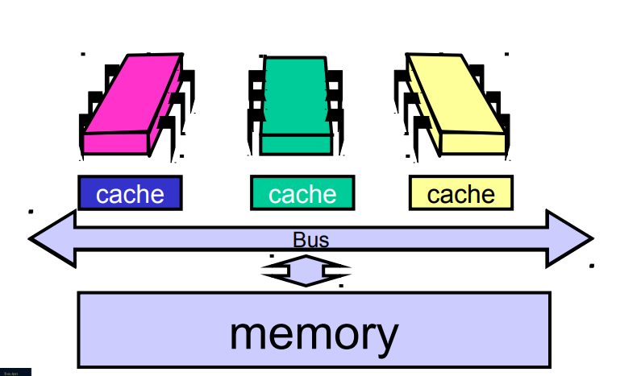
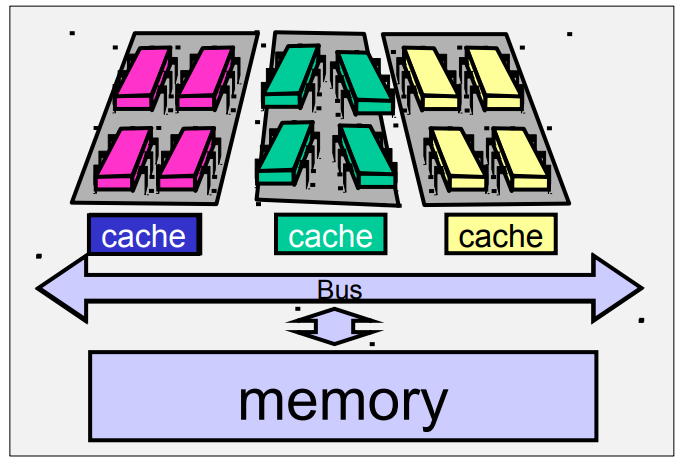
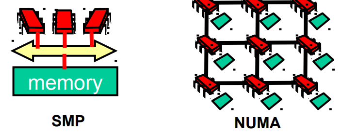

# Multicore processing
Old school multiprocessing used multiple CPUs, each with their own cache and a shared bus. Slow and expensive.

Modern multicore processing uses one CPU with multiple cores.

## Memory access
Presents problems when a core wants to use memory as its access is shared with the other cores.

* SMP: Symmetric multiprocessor
* NUMA: Non-uniform memory access
* CC-NUMA: Cache coherent NUMA

A bus (SMP) can only serve one request at a time whereas a network can (like NUMA) can facilitate multiple requests at the same time.

More details on caching and its impact on multiprocessing in recording and slides for 09/10/19.

## Cache coherence
If core A writes to its cache for address X, how does B find out that address X has changed?

### Write-through caching
If cache data is modified, it must be written back to memory.

If core A has the address in cache but core B requesting the address doesn't, A can send it to B. From then on it is shared. When either A or B then modifies the data it must write it through to memory.

An advantage is that aches and memory always agree, disadvantages are that there is bus traffic on every write which causes contention, and that a lot of writes could be to unshared data. These disadvantages are show stoppers for write-through cache.

### Write-back caching
Changes are accumulated in cache then written back once the line is evicted (for whatever reason).

## Scheduling
A compiler can reorder instructions (scheduling) to make full use of a CPUs pipeline. This can cause issues in a multiprocessing context if a precise order is needed. To avoid memory-affecting instructions from being reordered, a memory barrier can be inserted to prevent the compiler from doing scheduling within that section.

Many languages have a `volatile` keyword which prevent operations from being optimised out or reordered. Also useful for writing to hardware-mapped memory.
