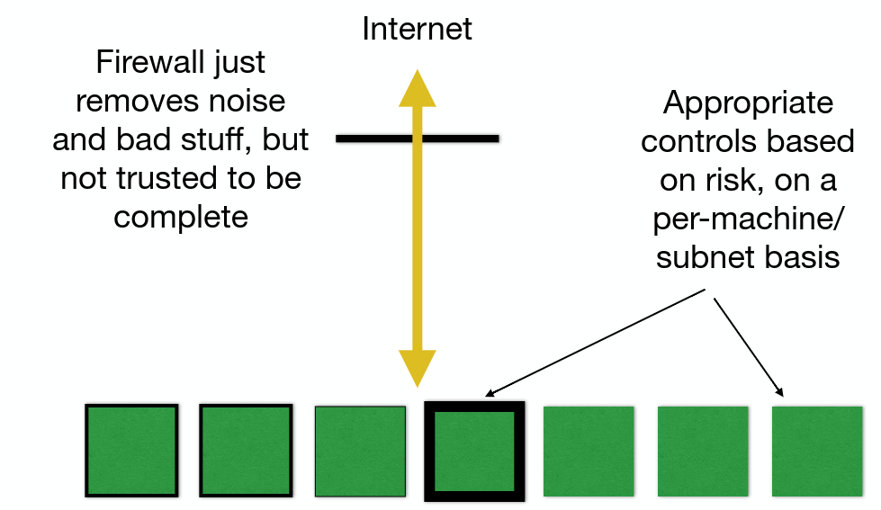

# Identifying assets
Typical sites will have a web server, mail server, file servers etc. Larger sites will have a large range of networked equipment (production equipment, ovens, centrifuges etc.). Ask "Why am I exposing this to the network?".

## Threats and risks
Who might want access to an asset? What may they do with it? What would it cost you if that happened? Legal implications? How may they attack it?

If a router or switch is broken into, the attacker may be able to reconfigure them to bypass further security measures.

# Protecting assets
Two extremes of protecting a network.

## Default deny
Pass all connections through a restrictive set of filters and proxies, isolating the internal systems while providing a small set of machines which communicate with the outside world.

Difficult to do and operationally painful. Companies try this and usually give up and is more common in government.

Inside and outside world can contact machines in the DMZ and the machines in DMZ are hardened enough to not be repurposed by attackers. Only allows connections initiated from the inside world to the DMZ, not the DMZ to the inside world.

Benefits are that you don't need to inventory the internal assets, just those exposed to the outside world, you can rely on the inside firewall to protect everything that isn't exposed and users can't (in general) expose stuff by accident.

Disadvantages are that it stops business from moving quickly, some activities are impossible or result in mixed architectures where some systems in the inside world are exposed to the outside world, providing vulnerable points.

### How default deny usually ends up

## Default permit
All internal systems have access to the internet and are responsible for their own security.

The whole network is exposed to the outside world with individual areas protcted on a case-by-case basis. Relies on security policy, ideally enforced by group policy. University networks are obvious examples.

More flexible and new systems can be brought in much quicker. Because all systems have to protect themselves, it doesn't matter as much if a nearby system is compromised. Administrative load is spread across departments.

Problems are that all machines are exposed to outside and inside threats. Lack of central policy means that the weakest link in the chain can be a problem. Auditors will be very nervous.

In reality many networks are becoming like this.
