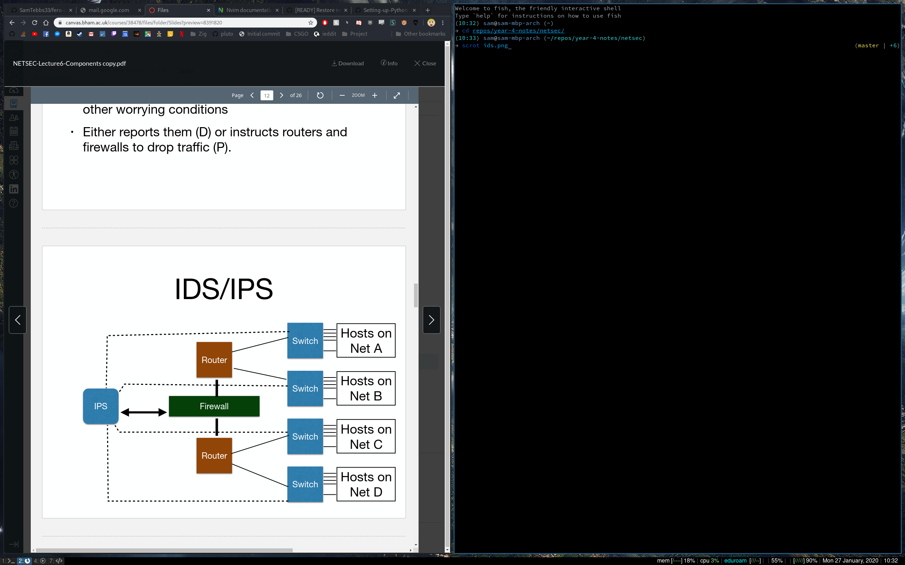

In order of complexity ascending:
* Hubs
	* Copy ethernet packets from one interface to all interfaces.
	* Provide no security and are being removed from netowkrs.
* Simple bridges
	* Copy ethernet packets from one interface to the others, dropping those that are malformed or corrupt.
	* Provide no protection.
* Switches and filtering switches
	* Copy ethernet packets from one interface to the believed destination interface.
	* Prevents an attacker on network A from obersiving traffic between hosts on network B.
	* Stop hosts from seeing anyone else's traffic.
* Routers
	* Look at IP header of packets and choose an interface to send them out of, based on routing tables.
	* Block malformed packets and packets they don't understand
* Filtering routers/firewalls
	* Act as a router but also look at the TCP and UDP ports and block/pass based on those values.
	* Shield services on systems from an attacker.
	* Minimum requirement to be a security component.
* Stateful firewalls/mainstream firewalls
	* Don't just look at TCP port but also keep track of the whole TCP state.
	* Tracks sequence numbers and connections so it knows what the next sensible packet type is.
	* Don't only shield services but also block more complex attacks on TCP connections.
	* Problems with performance when used in a complex or busy network.
	* Redundant pairs are difficult to get right as the whole state memory would need to be synchronised.
* Stateful firewalls++
	* Can rewrite TCP sequence numbers, reassemble fragments and re-order packets so that the TCP is presented to networked devices as cleanly as possible.
	* The idea is that protected systems only ever execute the most well-tested code paths (a clean TCP connection) so an attacker cannot probe weakness in less well-tested code.
	* Protect against unknown risks in rare code paths since packets only arrive in common states and conditions.
	* Can mean that the protected system can use the "fast" code path with the rare/untested "slow" path unused.
* Deep packet inspection
	* Looks at entire packet as it passes through the router.
	* Can operate as a virus scanner, can check protocols aren't being abused and can perform arbitrary re-writes.
	* Debatable as to how useful and worthwhile they are, as they can block innocent packets.
* Intrusion detection/prevention systems
	* Receive copy of traffic from switches and routers.
	* Examine whole packet to look for attacks and other 'worrying' conditions.
	* Either reports or blocks them.

* etc.

See slides from lecture 6 for details on protection mechanisms in equipment.
